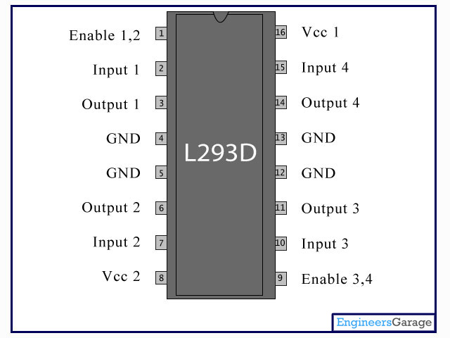

## L293D: Motor controller
To power the motors we are using an integrated circuit (ic) called L293D. Each side of the L293D act like an H-bridge. If we consider only one side of the L293D, the output voltage over the output pins are regulated by enable and input pins as described in table below:

| Pin1 (Enable 1,2) | Pin 2 (Input 1) | Pin 7 (Input 2) | Function         |
|:-------:|:-------:|:-------:|:------------------|
| High  | Low   | High  | Clockwise \*     |
| High  | High  | Low   | Anti-clockwise \*|
| High  | High  | Hight | Stop             |
| High  | Low   | Low   | Stop             |
| Low   | x     | x     | Stop             |
\*The direction of the motor depends how you connect it to the output pins.

By controlling signals on pins 2 and 7 it is possible to control spinning direction of the motor. Furthermore, PWM signal on enable pin can be used to control the rotational speed of the motor. The higher the duty cycle, the higher rotational speed of the motor. For further information about L293D check the datasheat following [this link](http://users.ece.utexas.edu/~valvano/Datasheets/L293D_ST.pdf).

<center>

</center>

## Assignment 2: Rotate a motor
Lets try rotate motor using the L293D circuit, voltage regulator and one of the motors. Perform following steps to assemble the circuit:

* Do for both motors:
  * Solder two wires to each terminal of the motor, one black and one red. It does not matter which color goes to which terminal as long as both motors have same color on same side. Wires can be found at the soldering station.
  * Attach encoder wheel and hall effect sensor the same way as in image bellow. Make sure that all wires are attached to motor with cable ties. That prevents damaging of the motor terminals if you accidentally pull one of the cables.

<center>

</center>


* Make sure that voltage regulator outputs 5v with an input of 12V from the AC/DC adapter. Check the voltage with a multimeter and adjust output volatge by turning knob on voltage regulator with a screwdriver.
* Attach single strand wire to the end of power cable provided and insulate them.(This will be easier to connect to breadboard) 
* Attach a power cable to the bottom row of the breadboard.
* Attach all components to the breadboard as on the schematic below.

<center>

</center>


In this configuration the bottom row of the breadboard marked with blue and red lines have output of 12V while the most upper two rows have output voltage of 5V. The 5V power is needed to power up raspberry pi, encoders and Arduino, while 12V is used to power up motors.

Try to rotate motors by uploading the following code to the Arduino.
```cpp
const byte LEFT_MOTOR_IN1 = 11;
const byte LEFT_MOTOR_IN2 = 10;
const byte LEFT_MOTOR_ENBL = 6;

void setup() {
  pinMode(LEFT_MOTOR_IN1, OUTPUT);
  pinMode(LEFT_MOTOR_IN2, OUTPUT);
  pinMode(LEFT_MOTOR_ENBL, OUTPUT);
}

void loop() {
  digitalWrite(LEFT_MOTOR_IN1,HIGH);
  digitalWrite(LEFT_MOTOR_IN2,LOW);
  analogWrite(LEFT_MOTOR_ENBL,50);
}
```

#### Task
By using code above as starting point make a function rotate_motor with five input arguments; pin_in1, pin_in2, pin_enbl, pwm, direction. The function should rotate motor that is attached to the pins on arduino specified in the three first arguments. Motor should rotate with a PWM signal and the direction you input as the last two arguments.

Make motor to rotate in sinusoidal wave pattern with PWM amplitude of 0-100 and period of 1 minute (i.e, the motor should rotate forward and backward with varying speed in the form of sign wave).

Use functions [sin](https://www.arduino.cc/en/Reference/Sin),[abs](https://www.arduino.cc/en/Reference/abs).