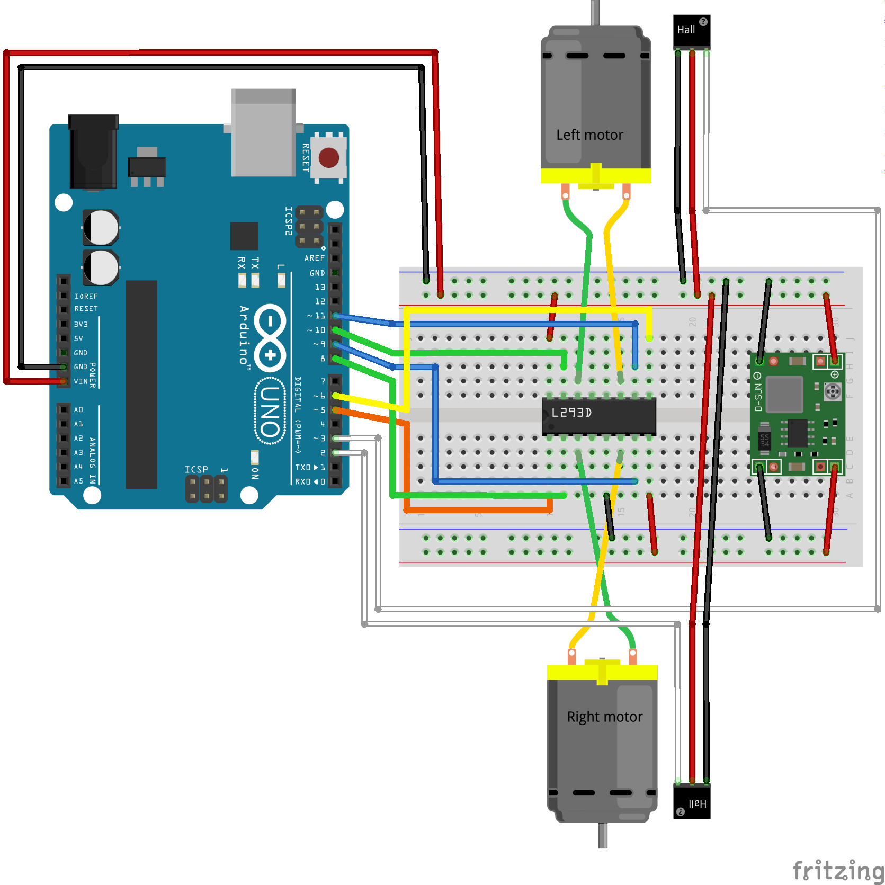

## Final Assignment
1. Assemble robot
  1. Mechanics
    * Solder wires to the motors.
    * Attach encoder wheel and the hall effect sensor.
    * Fasten cables with cable ties around the motor.  
    * Fasten arduino, breadboard and motors on the acrylic sheet, make sure there is space for RPi.
  2. Electronics
    * Solder wires to the voltage regulator.
    * Make sure that Voltage regulator output 5V while attached to 12V supply. You can check voltage with a multimeter.
    * Connect all parts as shown on the figure below.
2. Make both motors rotate
3. Read encoders for both motors
4. Code skeleton for implementing PID is available [here](https://github.com/KTH-EL2222/code). Further details of code are    
   in comments and Readme of the repository. 
5. Move the robot with certain velocity, say 0.2m/s by implementing PID control.
6. Move Robot in a circle of 1m diameter, apply PID to control speeds of both wheels to achieve this. 

If you are not familiar with differential drive kinematics read (this)[https://chess.eecs.berkeley.edu/eecs149/documentation/differentialDrive.pdf].