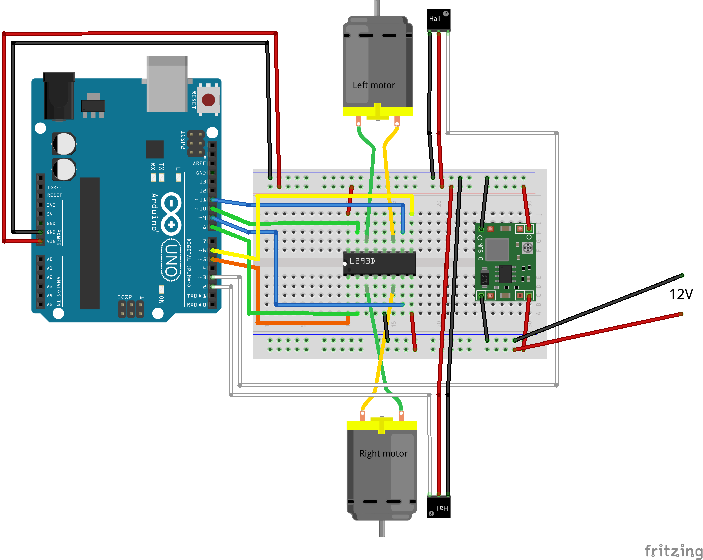

Workshop 1
==========
## Dictionary
* RPi = Raspberry Pi
* PWM = Pulse-width modulation

## Objective
In this lab you will be familirized with the hardware and tecniques that is going to be used to control robots motion. You will learn how to power up motors and read encoder signal within an arduino.

For this lab you will need following equipment:
* [Arduino UNO](https://www.arduino.cc/en/Main/ArduinoBoardUno)
* AB USB cable for connecting Arduino to a computer.
* Breadboard
* Jumper wires
* Power supply
* LED and resistor
* L293D (H-bridge)
* Voltage regulator
* Soldering station and soldering iron
* Computer with installed [Arduino IDE](https://www.arduino.cc/en/Main/Software)

## Assignment 0: Getting started with Arduino
In this assignment we will make an LED blink. Put the components as shown in the figure below, and follow this [quick start guide](https://www.arduino.cc/en/Guide/ArduinoUno).


## Pulse-width modulation (PWM)
Pulse Width Modulation (PWM) is a method for generating a replacement for continuously variable analogue signal using a digital source that can only vary the output between two values, off/low and on/high.  A PWM signal is controlled by two parameters; the duty cycle and the switching frequency.  The duty cycle describes the amount of time the signal is in a high (on) state as a percentage of the total cycle time (period).  In figure below we can see that the signal is on 25% of the cycle time.  The switching frequency determines how fast the PWM completes a cycle (i.e.  1000 Hz would be 1000 cycles per second), and therefore how fast it switches between high and low states.  By cycling the digital signal off and on at a fast enough rate, and with a certain duty cycle, the output will appear to behave like a constant voltage analog signal with a value anywhere between the low and the high level when providing power to devices.


As an example, to create a 3V signal given a digital source of 5V that can be either high (on) or low (off) at 0V, you can use PWM with a duty cycle of 60% which outputs 5V 60% of the time.  If the digital signal is cycled fast enough, then the voltage seen at the output appears to be the average voltage.  If the digital low is 0V (which is usually the case) then the average voltage can be calculated by taking the digital high voltage multiplied by the duty cycle, or 5V x 0.6 = 3V. Selecting a duty cycle of 80% would yield 4V, 20% would yield 1V, and so on.

PWM signals are used for a wide variety of control applications.  The main use in this lab will be for controlling DC motors, but it can also be used to control LEDs, servos, valves, pumps, hydraulics, and other mechanical parts.  The frequency that the PWM signal needs to be set at will be dependent on the application and the response time of the system that is being powered.  The switching frequency should be high compared to what the device can react to.

## Assignment 1: Dim the lights!
In the [assignment 0](#assignment-0-getting-started-with-arduino) you tried out a program that made a LED to blink. In this assignment we will dim LED using PWM technique. According to the [technical specifications](https://www.arduino.cc/en/Main/ArduinoBoardUno#techspecs) for Arduino UNO there are six available PWM pins. For this tutorial you need to connect your serial connection of LED and resistor to one of the PWM pins marked with ~. Connect you LED to pin number 9 and upload following code to the Arduino. By varying val you should see that intensity of the LED is depending on the duty cycle.  

```cpp
int LED_PIN = 9;      // LED connected to digital pin 9
int val = 100;         // value: the duty cycle: between 0 (always off) and 255 (always on).

void setup(){
  pinMode(LED_PIN, OUTPUT);   // sets the pin as output
}

void loop(){
  analogWrite(LED_PIN, val);  // analogWrite values from 0 to 255
}
```

#### Task
Using the code above as starting point, write a script that varies intensity of the LED in cycle of 5 seconds.

To complete this assignment in-build functions [millis()](https://www.arduino.cc/en/Reference/Millis), [delay()](https://www.arduino.cc/en/Reference/delay) and [analogWrite()](https://www.arduino.cc/en/Reference/AnalogWrite) should be sufficient.

----------------------

## L293D: Motor controller
To power the motors we are using an integrated circuit (ic) called L293D. Each side of the L293D act like an H bridge. If we consider only one side of the L293D, the output voltage over the output pins are regulated by enable and input pins as described in table below:

| Pin1  | Pin 2 | Pin 7 | Function         |
|-------|-------|-------|------------------|
| High  | Low   | High  | Clockwise \*     |
| High  | High  | Low   | Anti-clockwise \*|
| High  | High  | Hight | Stop             |
| High  | Low   | Low   | Stop             |
| Low   | x     | x     | Stop             |
\* The direction of the motor depends how you connect it to the output pins.

By controlling signals on pins 2 and 7 it is possible to control spinning direction of the motor. Furthermore, pwm signal on enable pin can be used to control the rotational speed of the motor. The higher the duty cycle, the higher rotational speed of the motor. For further information about L293D check the datasheat following [this link](http://users.ece.utexas.edu/~valvano/Datasheets/L293D_ST.pdf).


## Assignment 2: Rotate a motor
Lets try rotate motor using the L293D circuit, voltage regulator and one of the motors. Perform following steps to assemble the circuit:

* Do for both motors:
  * Solder two wires to each terminal of the motor, one yellow and one green. It does not matter which color goes to which terminal as long as both motors have same color on same side.    
  * Attach encoder wheel and hall effect sensor the same way as in image bellow. Make sure that all wires are attached to motor with cable ties.


* Make sure that voltage regulator outputs 5v with an input of 12V from the AC/DC adapter. Check the voltage with a multimeter and adjust output volatge by turning knob on voltage regulator with a screwdriver.
* Attach all components to the breadboard as on the schematic below.

* Attach a power cable to the bottom row of the breadboard.

In this configuration the bottom row of the breadboard marked with blue and red lines have output of 12V while the most upper two rows have output voltage of 5V. The 5V power is needed to power up raspberry pi, encoders and Arduino, while 12V is used to power up motors.

Try to rotate motors by uploading the following code to the Arduino.
```cpp
const byte LEFT_MOTOR_IN1 = 11;
const byte LEFT_MOTOR_IN2 = 10;
const byte LEFT_MOTOR_ENBL = 6;

void setup() {
  pinMode(LEFT_MOTOR_IN1, OUTPUT);
  pinMode(LEFT_MOTOR_IN2, OUTPUT);
  pinMode(LEFT_MOTOR_ENBL, OUTPUT);
}

void loop() {
  digitalWrite(LEFT_MOTOR_IN1,HIGH);
  digitalWrite(LEFT_MOTOR_IN2,LOW);
  analogWrite(LEFT_MOTOR_ENBL,50);
}
```

#### Task
By using code above as starting point make a function rotate_motor with five input arguments; in1, in2, enbl, pwm, direction. The function should rotate motor that is controlled by three first arguments, in the direction you assigned.

Make motor to rotate in sinusoidal wave pattern with PWM amplitude of 0-100 and period of 1 minute (i.e, the motor should rotate forward and backward with varying speed in the form of sign wave).

Use functions [sin](https://www.arduino.cc/en/Reference/Sin),[abs](https://www.arduino.cc/en/Reference/abs).

--------------
## Encoder
Encoder is:
> From [wikipedia](https://en.wikipedia.org/wiki/Rotary_encoder)
>
>an electro-mechanical device that converts the angular position or motion of a shaft or axle to an analog or digital code.


In your case the encoder for each motor consist of two parts, an encoder wheel and hall effect sensor. There is four ticks for each encoder wheel revolution. Each tick corresponds to a square pulse with one rising and one falling edge. Therefore there is eight changes per encoder wheel revolution. The ration of the gearbox on the motor is 1:48, that is 48 revolutions of the encoder wheel for one revolution of the robot wheel.

## Assignment 3: Read the encoder.
In order to detect encoder tics, the data wire of the hall effect sensor is connected to one of the interrupt pins on the Arduino. As per the connections in assignment 2, encoder signal is connected to pin3 on arduino which is an interrupt pin.

The current encoder wheel and sensor configuration gives 4 pulses for one rotation of encoder wheel. The motor to wheel gear ratio is 1:48, thus per rotation of wheel there will be 192 pulses. 

The below code outputs* encoder counter value periodically, use this to verify how many pulses are generated per rotation of wheel(rotate motor with hand).
*The values are output as serial data and more information about arduino serial communication can be found [here](https://www.arduino.cc/en/Reference/Serial) and [here](https://www.arduino.cc/en/Tutorial/SoftwareSerialExample).
In arduino GUI, Tools->Serial Monitor to view the data on Serial Bus.

```cpp
const byte encoderPin = 3;
unsigned int count=0;

void setup() {
  pinMode(encoderPin, INPUT_PULLUP);
  attachInterrupt(digitalPinToInterrupt(encoderPin), encoder_counter, RISING);
  Serial.begin(9600); //Begin Serial communication with 9600 baud rate
}

void loop() {
  Serial.println(count); // send count data with a new line at end. 
  delay(200);
}

void encoder_counter() {
  count++;
}
```
#### Task
By using above code as starting point make a function that calculates angular velocity of the wheel in rotations per second (rps). Furthermore it is possible to double the resolution of the encoder by configuring the interrupt to trigger on CHANGE (i.e, on both falling and rising edge). 

Verify that the estimation of angular speed is correct by mnaually measuring the angular velocity of the motor. To make sure that motor speed is constant you can plot the estimated angular velocity on the [Serial Plotter](https://www.youtube.com/watch?v=f7SAO2FCxdg).

------------------------------
#### Final Task
1. Assemble robot
  1. Mechanics
    * Solder wires to the motors.
    * Attach encoder wheel and the hall effect sensor.
    * Fasten cables with cable ties around the motor.  
    * Fasten arduino, breadboard and motors on the acrylic sheet, make sure there is space for RPi.
  2. Electronics
    * Solder wires to the voltage regulator.
    * Make sure that Voltage regulator output 5V while attached to 12V supply. You can check voltage with a multimeter.
    * Connect all parts as shown on the following figure.
    
2. Make both motors rotate
3. Read encoders for both motors
4. Move the robot with certain velocity, say 0.2m/s by implementing PID control. 
