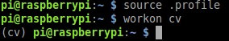

# OpenCV

> OpenCV:
>
>(Open Source Computer Vision) is a library of programming functions mainly aimed at real-time computer vision.

In this workshop we are going to use PRi camera and OpenCV to detect and follow a <!-- TODO: check if it will be a ball or circle --> ball/circle. To make sure that Rpi camera is properly configured let us try to capture an image. Run `raspistill -o output.jpg` in the terminal. This command should enable RPi camera, take a snapshot and save it to `output.jpg`. Checkout your image by typing `gpicview output.jpg`. If camera works fine lets continue to acquiring image stream with python and OpenCV.


## Capture video stream in python
In terminal create a directory where you can store your code and cd to your new directory. Create a new file and open it with <!-- TODO: check codeblocks for RPi --> geany editor by typing `geany <FILENAME>.py` in terminal. In the created python document paste following code.

```python
# import the necessary packages
from picamera.array import PiRGBArray
from picamera import PiCamera
import time
import cv2

# initialize the camera and grab a reference to the raw camera capture
camera = PiCamera()
camera.resolution = (640, 480)
camera.framerate = 32
rawCapture = PiRGBArray(camera, size=(640, 480))

# allow the camera to warmup
time.sleep(0.1)

# capture frames from the camera
for frame in camera.capture_continuous(rawCapture, format="bgr", use_video_port=True):
	# grab the raw NumPy array representing the image, then initialize the timestamp
	# and occupied/unoccupied text
	image = frame.array

	# show the frame
	cv2.imshow("Frame", image)
	key = cv2.waitKey(1) & 0xFF

	# clear the stream in preparation for the next frame
	rawCapture.truncate(0)

	# if the `q` key was pressed, break from the loop
	if key == ord("q"):
		break
```

Save it and switch back to your terminal. in order to run code you have to switch to a virtual environment called cv. Run following commands to change to virtual environment `source ~/.profile` and `workon cv`. Your terminal output should be similar to the image below.



Now you are ready to run your python script by typing `python <FILENAME>.py`. If output is `python: can't open file...` then make sure that your current directory is where you saved your python code. For further explanation of this code read Step 6 on this [web page](http://www.pyimagesearch.com/2015/03/30/accessing-the-raspberry-pi-camera-with-opencv-and-python/#crayon-57f512c8e35c5004277174).

From this point and on we are going to use OpenCV library to detect circles in the images with a certain color.

## Some image theory

A colored digital image usually consists of three dimensions: width, height and color channels. An RGB image consist of three channels Red, Green and Blue. The three channels are added together to reproduce a broad array of other collors.


Intensity of each channel is usually represented with 8-bit resolution. That means that each value can vary between 0 and 255. In the table below you can see some of the RGB-values and what color they represent. If you want to see representation of other colors checkout [this color picker](http://www.rapidtables.com/web/color/RGB_Color.htm).

|R-value|G-value|B-value|Color|
|--|--|--|--|
|0|0|0|Black|
|255|0|0|Red|
|0|255|0|Green|
|0|0|255|Blue|
|255|255|255|White|

Another popular color model that is used in image analysis is called HSV (Hue-Saturation-Value). HSV representation is more intuitive than the RGB model. If you want to target a specific color you need to chose an relevant interval in Hue and then adjust value and saturation intervals to match the lightning condition of the environment.

Another methodology we are going to use in this workshop is called Hough transform. Hough transform is used to find lines or circles in an image. If you want to know more about hough transform checkout [wikipedia page for hough transform](https://en.wikipedia.org/wiki/Hough_transform) or ask the teaching assistant.

## Assignment: I see circles.
<!-- TODO: change to a number -->
Now lets implement a hough transform to detect round objects. For that we are going to use an OpenCV function that is called [HoughCircles](http://docs.opencv.org/2.4/modules/imgproc/doc/feature_detection.html?highlight=houghcircles#houghcircles). It has four compulsory parameters `image, method, dp, minDist`. According documentation image should be a 8-bit, single channel and gray-scaled. Method is `cv2.cv2.HOUGH_GRADIENT`, and `dp` and `minDist` are the design parameters that are free to chose. `dp` is controlling the resolution of the hough space and `minDist` is the minimum distance between the circle centers. `dp = 1` and `minDist = 20` should work fine. Function is returning an array of the parameters for the circles that were found in the image. The circle parameters consist of the coordinates for the center of the circle, `x,y` and the radius of the circle `r`. Circles that corresponds to the highest accumulated value are returned fist.

Before running this function in the python script you should convert your image from BGR to gray-scale. Yes BGR, OpenCV using BGR (Blue-Green-Red) as default color space due to a [historical reason](https://www.learnopencv.com/why-does-opencv-use-bgr-color-format/). To transform an image from BGR to gray-scale use following function `gray_image = cv2.cvtColor(image, cv2.COLOR_BGR2GRAY)`.

Now what is fun of detecting circles without showing it on screen. To draw a circle in your image use `cv2.circle(image,(x,y),r,(B,R,G))`, where `(x,y)` is the coordinates of the circle center, `r` is a radius and `(R,G,B)` is the color of the drawn circle.
<!-- TODO: check if function above works -->

### Task
Modify your code so that you can detect a circles and draw detected circles on the screen.

## Assignment: Remove false circles.

As you can see, there are a lot of false positive detections, lets try to reduce false positives by taking into account color of the circle.

Before starting with color detection we want to make sure that we have control over white-balance. To gain control over the white-balance for current lightning conditions we need to switch off auto white-balance and find a custom white-balance that is good for current lightning conditions. Point you RPi camera towards an area that should be white/gray and run the `camera_calibration.py` script.
<!-- TODO: add the script and name of the script -->
The script assume that biggest part of the scene is gray, e.i. there should be equal intensity of the red, green and blue channels. It tries to find red and blue gains such that intensity over each channel is almost same for the gray areas. After finding red and blue gains, use code below to turn off white balance and setup your own gains.

 <!-- TODO: add code here turn off white-balance and setup own gains -->

To detect specific colors we filter out HSV values that not correspond to the color of interest. To find good thresholds use `color_detection.py` script. Drag the track-bars until you are satisfied with your results. Note good values for thresholds that are going to be used later in your code.

### Task
Adjust your code so that circles that not corresponds to the color of your circle are not detected. Use function `hsv_image = cv2.cvtColor(image, cv2.COLOR_BGR2HSV)` to convert your image to HSV color space. A simple solution is to check if the HSV values of the center coordinate of the circle are satisfied by the threshold you have found for your color.
<!-- TODO:check if function working -->
